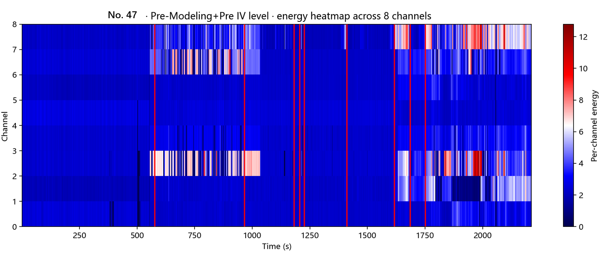
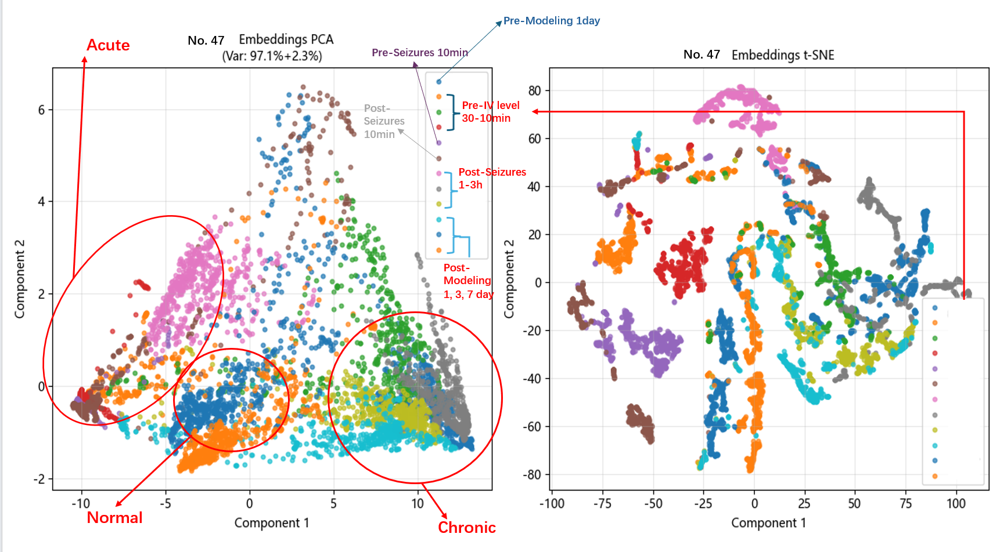

# Deep Learning Applied to EEG Change Point Detection

## Research Motivation

Epileptic EEG recordings often contain abrupt transitions related to seizure onset, propagation, and post-intervention changes. This project explores whether deep neural representations can be used as a feature space for change point detection in multi-channel rat EEG recordings.

The workflow combines:

1. window-level EEG representation learning using a CNN-BiLSTM-Attention model;
2. feature extraction from learned embeddings;
3. kernel-based PELT change point detection in embedding space;
4. statistical filtering of candidate change points;
5. subject-level visualization across experimental stages.

## Project structure

```text
.
|-- cpd_legacy_core.py
|-- src/eeg_cpd/
|   |-- config.py
|   |-- data.py
|   |-- preprocessing.py
|   |-- models.py
|   |-- training.py
|   |-- inference.py
|   |-- change_point.py
|   |-- visualization.py
|   `-- pipeline.py
|-- scripts/
|   |-- run_script.py
|   `-- run_modular.py
|-- notebooks/
|   `-- eeg_cpd_workflow.ipynb
|-- configs/
|   |-- config.example.json
|   `-- selected_subjects.example.json
|-- legacy/
|   |-- CPD_visualized_original.py
|   `-- README.md
|-- matlab/
|   `-- xfyp_data_modified.m
|-- results/
|-- plots/
|-- requirements.txt
`-- .gitignore
```

## Install dependencies

Create a clean environment if you want to run the project:

```bash
conda create -n eeg-cpd python=3.10
conda activate eeg-cpd
pip install -r requirements.txt
```

For GitHub upload only, no conda environment is required.

## Configure paths

Copy the example config and edit paths if needed:

```bash
copy configs\config.example.json configs\config.local.json
```

Copy `configs/config.example.json` to `configs/config.local.json` and replace the placeholder paths with local paths.

Important fields:

- `data_dir`: root folder containing filtered `.h5` EEG files
- `labels_csv`: CSV file with file-level labels
- `output_dir`: directory for checkpoints, CPD tables, and plots
- `checkpoint`: path to the trained model checkpoint
- `subject_token`: optional filename token for embedding visualization

## Run

cpd_legacy_core.py is retained for reproducibility and should not be run directly; use scripts/run_modular.py instead.

Scan selected H5 files:

```bash
python scripts/run_modular.py --config configs/config.local.json --mode scan
```

Train the original CNN-BiLSTM-Attention model:

```bash
python scripts/run_modular.py --config configs/config.local.json --mode train
```

Run two-block subject-level CPD:

```bash
python scripts/run_modular.py --config configs/config.local.json --mode detect-two-blocks
```

Run full-timeline subject-level CPD:

```bash
python scripts/run_modular.py --config configs/config.local.json --mode detect-full-timeline
```

Visualize learned embeddings:

```bash
python scripts/run_modular.py --config configs/config.local.json --mode embedding
```

## Example Outputs

### Subject-level probability curve with detected change points


### Channel-wise EEG energy heatmap with detected change points


### Learned embedding visualization


## Modular API

The recommended Python-facing modules are:

- `eeg_cpd.data`: file scanning, label handling, subject timeline grouping
- `eeg_cpd.preprocessing`: robust normalization and signal concatenation
- `eeg_cpd.models`: CNN-BiLSTM-Attention model and checkpoint loading
- `eeg_cpd.training`: training and validation entry points
- `eeg_cpd.inference`: probability and embedding extraction
- `eeg_cpd.change_point`: feature-space CPD and statistical filtering
- `eeg_cpd.visualization`: probability, heatmap, PCA/t-SNE, and EEG plots
- `eeg_cpd.pipeline`: high-level scan/train/detect/visualize workflows

Example:

```python
from eeg_cpd.config import load_runtime_config
from eeg_cpd.pipeline import prepare_project, visualize_embeddings

cfg = load_runtime_config("configs/config.local.json")
output_dir, files, subject_map = prepare_project(cfg)
times, feats, file_idx = visualize_embeddings(cfg)
```

## Expected Data Format

Raw EEG recordings are not included in this repository. The pipeline expects filtered EEG recordings stored as `.h5` files with the following structure:

```text
/sig
  shape: [channels, time_points]
  attrs:
    Fs: sampling frequency
```

## Data source and exclusions

The project is based on EEG data associated with a rat status epilepticus study
on hippocampal ripple oscillation energy and gap junction blockers. The local
dataset is organized into five folders: blank control, VPA, sponges, PILO, and
mir overexpression groups. Each group contains individual animal folders with
recordings across the modeling timeline.

Raw EEG data and trained checkpoints are not included because of privacy and file-size constraints.

The blank control group and some recordings from the remaining groups were not
used when EDF header or acquisition-format problems prevented reliable reading.
These exclusions should be documented as data-quality filters.

## Limitations

- Raw EEG recordings and trained checkpoints are not included due to privacy and file-size constraints.
- The current implementation preserves the original experimental code path and is not intended as a fully optimized software package.
- Change points are detected in learned feature space and should be interpreted as candidate transitions requiring domain validation.
- The pipeline is designed for the local H5 data organization used in the original study; adapting it to another EEG dataset may require changes to file naming and label parsing.
